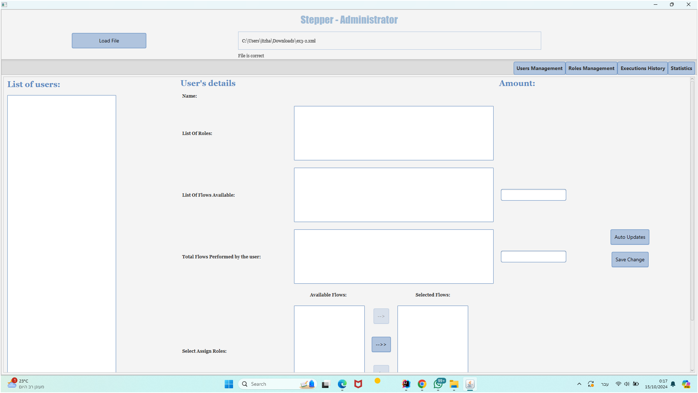
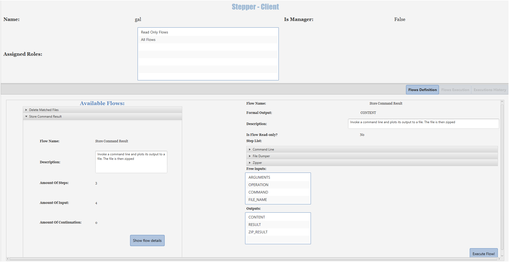
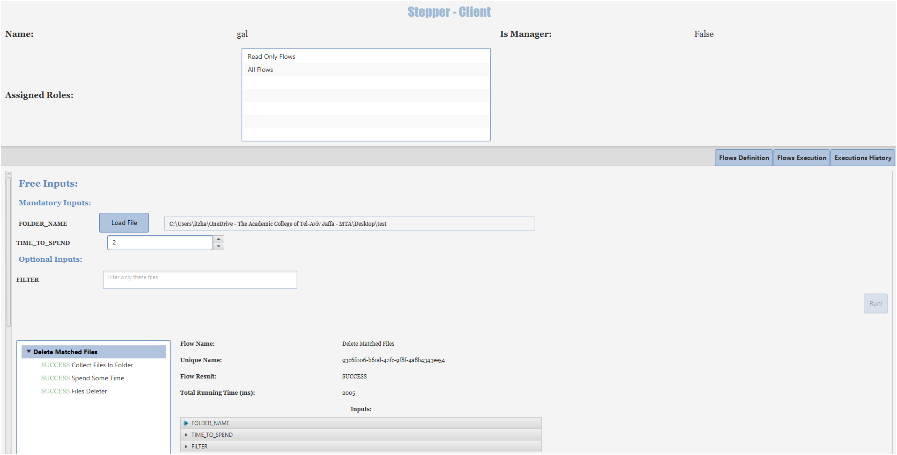
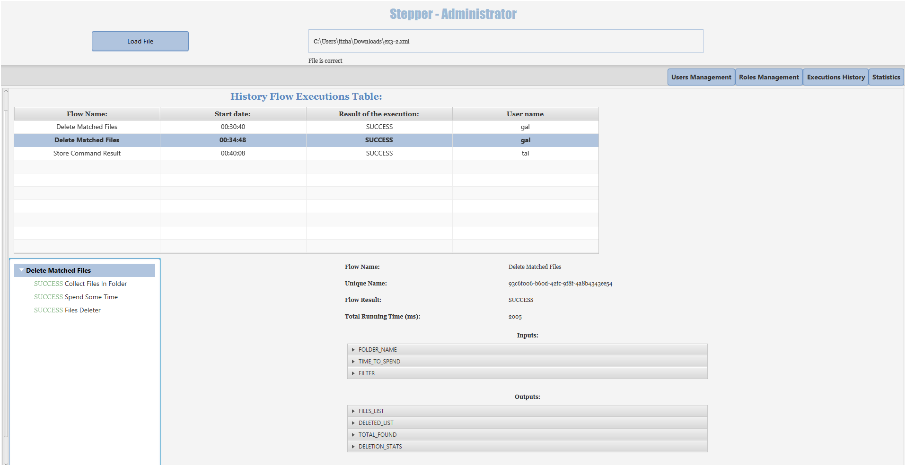
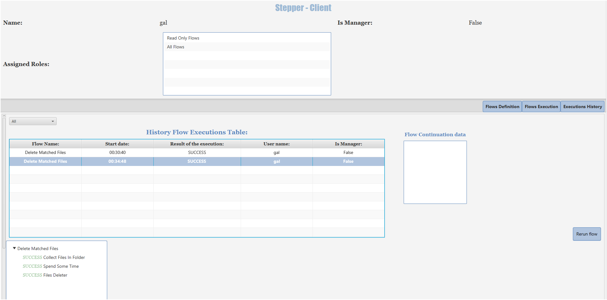
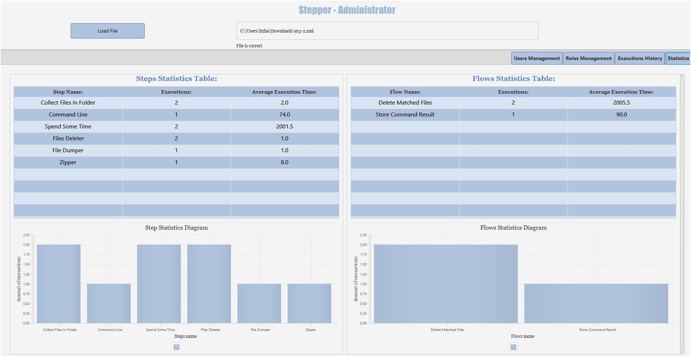

# Stepper Project - Flow Management System

**Stepper** is a modular system designed to help non-technical users define, manage, and execute complex technical flows made up of reusable steps. The system is user-friendly, flexible, and allows for decentralized management of users and permissions.

---

## 🛠 Key Features

- **Flow Creation & Execution**: Define custom flows using XML files and execute them step-by-step, with comprehensive feedback on success, failure, or warnings for each step.
- **User & Role Management**: Administer users and assign specific roles and permissions based on available flows.
- **Execution History**: Track detailed flow execution history, including user activity, flow results, and logs.
- **Performance Statistics**: Visualize performance data, including execution times for flows and individual steps, through a dedicated statistics dashboard.

---

## 🚀 Usage

1. **Load a Flow**: Start by loading a flow XML file to define the steps and structure of the flow.
2. **Manage Users and Roles**: Use the "Roles Management" tab to assign roles to users, enabling them to access and execute flows.
3. **Execute Flows**: Navigate to the "Flows Execution" tab, execute flows, and monitor their progress in real-time.
4. **View Statistics**: Access detailed performance statistics in the "Statistics" tab, including step execution times and flow performance metrics.

---

## 📸 Screenshots

### Admin Panel

### User Details & Flow Management

### Flow Execution - Client Side

### Execution History - Admin Side

### Execution History - Client Side

### Statistics Dashboard

---

## ⚙️ Technologies Used

- **Java**: Backend logic and flow execution.
- **JavaFX**: Graphical User Interface (GUI) framework.
- **XML**: Flow definitions for dynamic step execution.
- **JavaFX Charts**: Used for visualizing flow and step performance.

---

## 📖 Project Structure

- **Admin Panel**: A central management interface for loading flow files, managing users, and assigning roles.
- **Client Interface**: Allows users to select, execute, and monitor flows, with real-time updates.
- **Statistics & History**: A section dedicated to tracking execution results and visualizing performance metrics.

---

## 💡 Future Enhancements

- **Remote Flow Execution**: Adding client-server architecture to enable remote execution and management of flows.
- **Additional Input Types**: Expanding the range of input types supported in flows.
- **Enhanced Error Handling**: Improving the system’s ability to handle exceptions and provide more detailed feedback to users.

---
